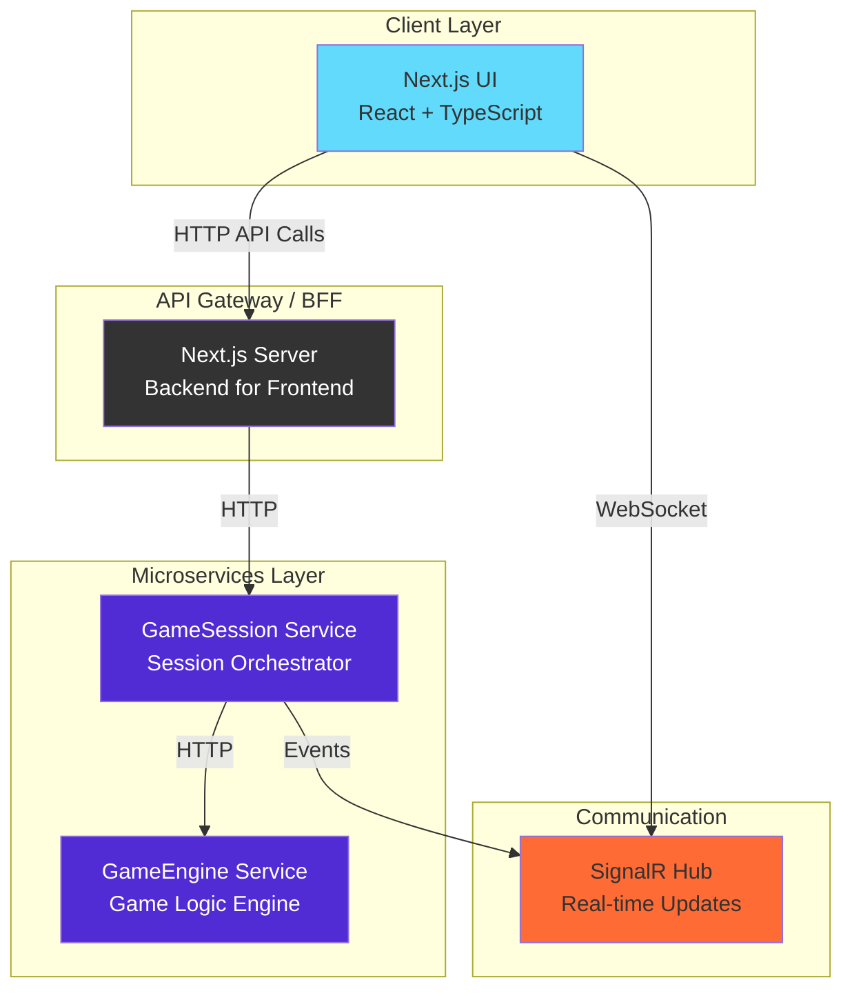
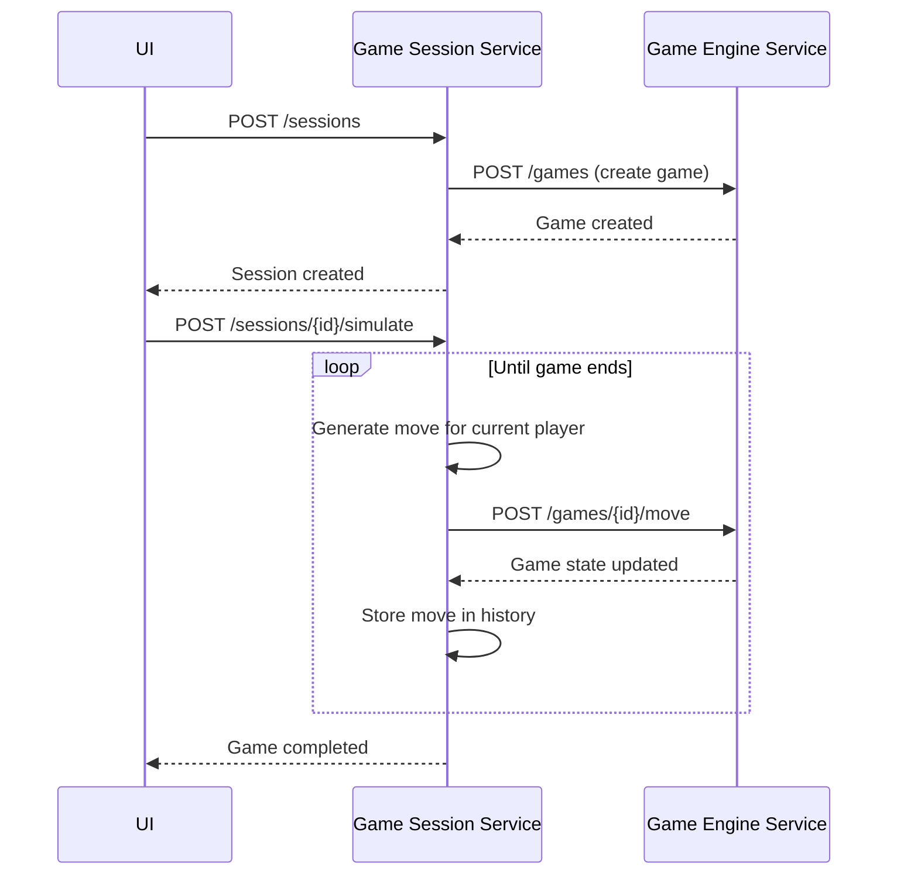
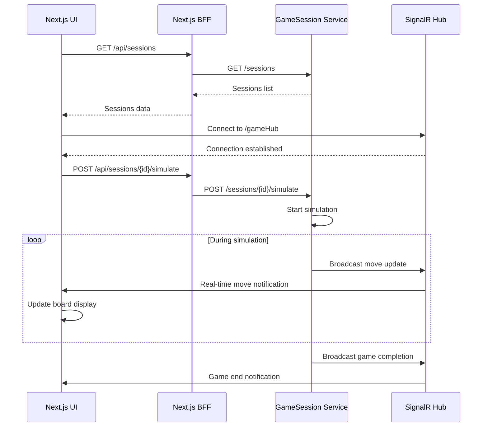
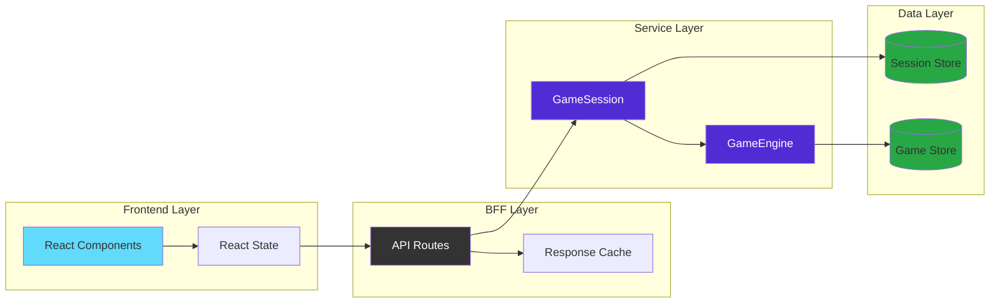
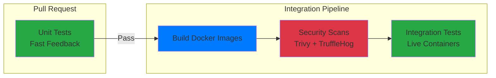

# Tic Tac Toe - Distributed Microservices Architecture

[](https://github.com/dmitrycx/TicTacToe/actions)
[](https://dotnet.microsoft.com/)
[](LICENSE)

A production-ready demonstration of modern microservices architecture, featuring automated Tic Tac Toe gameplay with real-time visualization. Built with .NET 9, Next.js 15, and orchestrated by .NET Aspire.

## 🎯 Overview

This project showcases a distributed system where two AI players compete in Tic Tac Toe, with the entire game orchestrated by microservices and visualized in real-time through a modern web interface. The architecture demonstrates enterprise-grade patterns including:

- **Domain-Driven Design** with clean separation of concerns
- **Event-driven communication** via SignalR for real-time updates
- **Backend for Frontend (BFF)** pattern for secure API access
- **Container-first development** with comprehensive CI/CD
- **Comprehensive testing** strategy with unit and integration tests

## 🏗️ Architecture

The system employs a distributed microservices architecture with clear boundaries and responsibilities:



### Service Responsibilities

| Service | Technology | Port | Responsibility |
|---------|------------|------|----------------|
| **GameEngine** | .NET 9 + FastEndpoints | 5185 | Core game logic, board state, move validation |
| **GameSession** | .NET 9 + FastEndpoints + SignalR | 5001 | Session management, AI move orchestration |
| **WebUI** | Next.js 15 + React + TypeScript | 3000 | User interface with real-time updates |

## 🔄 System Interactions

### Game Simulation Flow



### Real-Time Communication Flow



### Data Flow Architecture



## 🚀 Quick Start

### Prerequisites

- **.NET SDK 9.0.200** (see `global.json`)
- **Docker Desktop** (for containerized development)
- **Node.js 18+** (for Next.js frontend)
- **Git** (for version control)

### Development Setup

1. **Clone and Navigate**
   ```bash
   git clone https://github.com/dmitrycx/TicTacToe.git
   cd TicTacToe
   ```

2. **Start Backend Services**
   ```bash
   # Option A: Using .NET Aspire (Recommended)
   dotnet run --project aspire/TicTacToe.AppHost
   
   # Option B: Individual services
   dotnet run --project src/TicTacToe.GameEngine
   dotnet run --project src/TicTacToe.GameSession
   ```

3. **Configure Frontend**
   ```bash
   cd src/TicTacToe.WebUI
   npm install
   
   # Create environment file
   cp .env.example .env.local
   # Update NEXT_PUBLIC_SIGNALR_HUB_URL with your GameSession URL
   ```

4. **Start Frontend**
   ```bash
   npm run dev
   ```

5. **Access the Application**
   - **UI**: http://localhost:3000
   - **Aspire Dashboard**: http://localhost:17122
   - **GameSession Swagger**: http://localhost:5001/swagger
   - **GameEngine Swagger**: http://localhost:5185/swagger

## 🧪 Testing

The project includes a comprehensive testing strategy with both unit and integration tests:

```bash
# Run all tests
dotnet test ./TicTacToe.sln

# Unit tests only (fast feedback)
dotnet test --filter "Category=Unit"

# Integration tests (against live containers)
dotnet test --filter "Category=Integration"

# With coverage
dotnet test --collect:"XPlat Code Coverage"
```

### Test Structure

```
tests/
├── TicTacToe.GameEngine.Tests/
│   ├── Features/
│   │   ├── CreateGame/
│   │   ├── GetGameState/
│   │   └── MakeMove/
│   └── TestHelpers/
└── TicTacToe.GameSession.Tests/
    ├── Features/
    │   ├── CreateSession/
    │   ├── SimulateGame/
    │   └── SessionManagement/
    └── TestHelpers/
```

## 🔄 CI/CD Pipeline

The project features a production-grade CI pipeline with security scanning and container-based testing:



### Pipeline Features

- **Two-Stage Validation**: Fast unit tests → comprehensive integration tests
- **Security Scanning**: Dependency review, secrets detection, container vulnerability scanning
- **Container-First**: Tests run against actual Docker images
- **Artifact Retention**: 7-day retention for debugging and analysis

## 🏛️ Architecture Patterns

### Domain-Driven Design

The backend services follow DDD principles with clear domain boundaries:

```
src/TicTacToe.GameEngine/
├── Domain/
│   ├── Aggregates/     # Game aggregate root
│   ├── Entities/       # Board entity
│   ├── ValueObjects/   # Position, GameStatus
│   └── Exceptions/     # Domain exceptions
├── Endpoints/          # API endpoints
└── Persistence/        # Repository pattern
```

### Backend for Frontend (BFF)

The Next.js server acts as a BFF layer, providing:
- **Security**: Hides internal service complexity
- **Optimization**: Tailored APIs for frontend needs
- **Caching**: Reduces backend load
- **Error Handling**: Centralized error management

### Event-Driven Communication

SignalR enables real-time updates:
- **Move Notifications**: Instant board updates
- **Game State Changes**: Status transitions
- **Error Broadcasting**: Real-time error feedback

## 🔧 Configuration

### Environment Variables

```bash
# GameSession Service
GAME_ENGINE_URL=https://localhost:5185
CORS_ORIGINS=http://localhost:3000

# Next.js Frontend
NEXT_PUBLIC_SIGNALR_HUB_URL=https://localhost:5001/gameHub
```

### Docker Configuration

The project supports multiple deployment modes:

```bash
# Development (project-based)
dotnet run --project aspire/TicTacToe.AppHost

# Container mode (pre-built images)
dotnet run --project aspire/TicTacToe.AppHost --use-containers

# Dockerfile mode (build from source)
dotnet run --project aspire/TicTacToe.AppHost --use-dockerfiles
```

## 📚 API Documentation

Interactive API documentation is available when services are running:

- **GameSession API**: http://localhost:5001/swagger
- **GameEngine API**: http://localhost:5185/swagger
- **OpenAPI JSON**: Available at `/swagger/v1/swagger.json`

### Key Endpoints

| Service | Endpoint | Method | Description |
|---------|----------|--------|-------------|
| GameSession | `/sessions` | POST | Create new game session |
| GameSession | `/sessions/{id}/simulate` | POST | Start automated gameplay |
| GameSession | `/sessions/{id}` | GET | Get session details |
| GameEngine | `/games/{id}/move` | POST | Make a game move |
| GameEngine | `/games/{id}` | GET | Get game state |

## 🛡️ Security Features

- **CORS Configuration**: Properly configured for development and production
- **Input Validation**: Comprehensive validation using FluentValidation
- **Error Handling**: Secure error responses without information leakage
- **Container Security**: Vulnerability scanning in CI pipeline
- **Dependency Scanning**: Automated vulnerability detection

## 🚀 Deployment

### Local Development

```bash
# Full stack with Aspire
dotnet run --project aspire/TicTacToe.AppHost

# Individual services
dotnet run --project src/TicTacToe.GameEngine
dotnet run --project src/TicTacToe.GameSession
cd src/TicTacToe.WebUI && npm run dev
```

### Container Deployment

```bash
# Build images
docker build -f GameEngine.Dockerfile -t tictactoe-gameengine:latest .
docker build -f GameSession.Dockerfile -t tictactoe-gamesession:latest .

# Run with Docker Compose
docker-compose up -d
```

## 🔮 Future Enhancements

- **Database Persistence**: PostgreSQL with Entity Framework Core
- **Message Broker**: RabbitMQ for asynchronous communication
- **Authentication**: JWT-based authentication and authorization
- **Monitoring**: Application Insights and health monitoring
- **Load Balancing**: Kubernetes deployment with ingress
- **End-to-End Testing**: Playwright test suite

## 🤝 Contributing

1. Fork the repository
2. Create a feature branch (`git checkout -b feature/amazing-feature`)
3. Commit your changes (`git commit -m 'Add amazing feature'`)
4. Push to the branch (`git push origin feature/amazing-feature`)
5. Open a Pull Request

## 📄 License

This project is licensed under the MIT License - see the [LICENSE](LICENSE) file for details.

## 🙏 Acknowledgments

- **.NET Aspire** for local development orchestration
- **FastEndpoints** for high-performance API development
- **Next.js** for the modern React framework
- **SignalR** for real-time communication
- **Tailwind CSS** for utility-first styling

---

**Built with ❤️ using modern .NET and Next.js technologies**