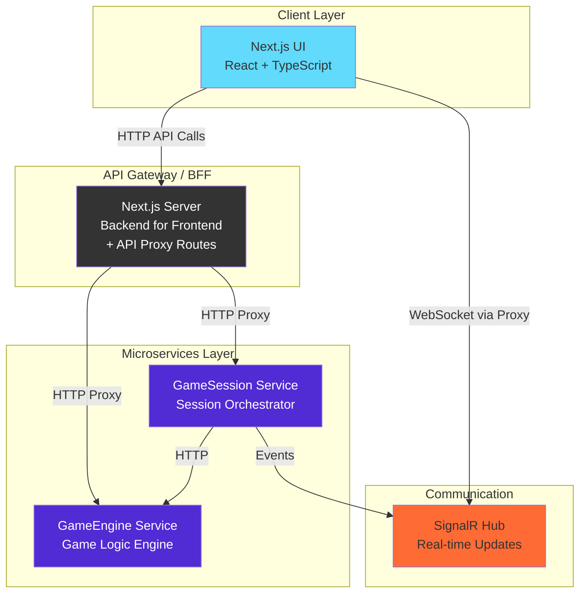
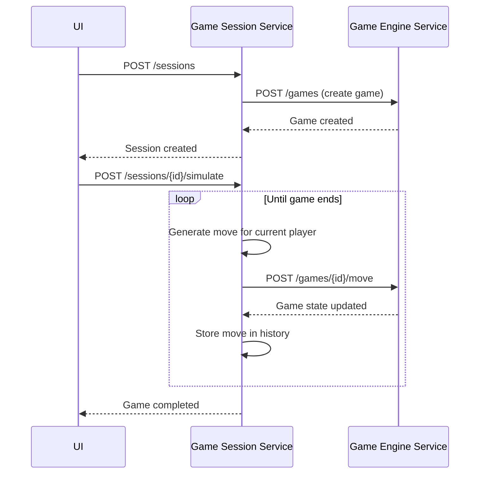
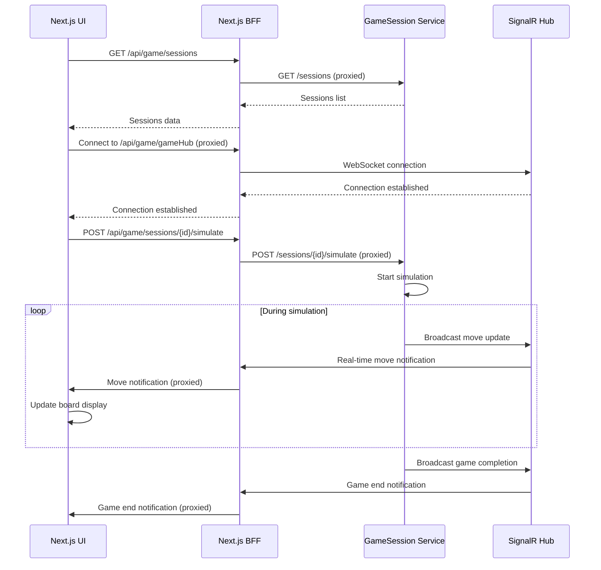
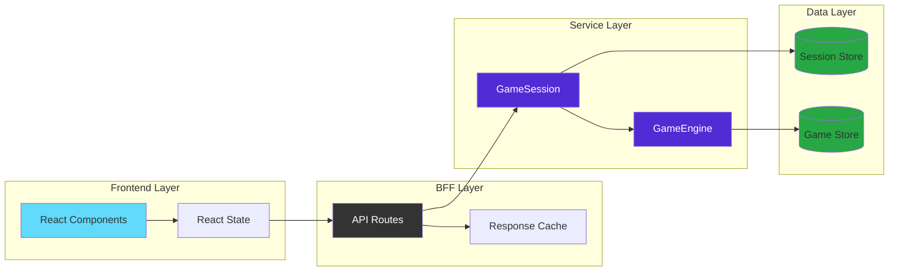

# Tic Tac Toe - Distributed Microservices Architecture

[](https://github.com/dmitrycx/TicTacToe/actions)
[](https://dotnet.microsoft.com/)
[](LICENSE)

A production-ready demonstration of modern microservices architecture, featuring automated Tic Tac Toe gameplay with real-time visualization. Built with .NET 9, Next.js 15, and orchestrated by .NET Aspire.

## 🎯 Overview

This project showcases a distributed system where two AI players compete in Tic Tac Toe, with the entire game orchestrated by microservices and visualized in real-time through a modern web interface. The architecture demonstrates enterprise-grade patterns including:

- **Domain-Driven Design** with clean separation of concerns
- **Event-driven communication** via SignalR for real-time updates
- **Backend for Frontend (BFF)** pattern for secure API access
- **Container-first development** with comprehensive CI/CD
- **Comprehensive testing** strategy with unit and integration tests
- **Modern orchestration** with .NET Aspire for seamless development and deployment

## 🏗️ Architecture

The system employs a distributed microservices architecture with clear boundaries and responsibilities:



### Service Responsibilities

| Service | Technology | Port | Responsibility |
|---------|------------|------|----------------|
| **GameEngine** | .NET 9 + FastEndpoints | 8080 | Core game logic, board state, move validation |
| **GameSession** | .NET 9 + FastEndpoints + SignalR | 8081 | Session management, AI move orchestration |
| **WebUI** | Next.js 15 + React + TypeScript | 3000 | User interface with real-time updates |

## 🔄 System Interactions

### Game Simulation Flow



### Real-Time Communication Flow



### Data Flow Architecture



## 🚀 Quick Start

### Prerequisites

- **.NET SDK 9.0.200** (see `global.json`)
- **Docker Desktop** (for containerized development)
- **Node.js 18+** (for Next.js frontend)
- **Git** (for version control)

### Development Setup

1. **Clone and Navigate**
   ```bash
   git clone https://github.com/dmitrycx/TicTacToe.git
   cd TicTacToe
   ```

2. **Start with .NET Aspire (Recommended)**
   ```bash
   # Start all services (backend + frontend) with hot reload
   dotnet run --project aspire/TicTacToe.AppHost
   ```
   
   This will start:
   - **GameEngine** service (.NET project with hot reload)
   - **GameSession** service (.NET project with hot reload)  
   - **Next.js UI** (dev server with hot reload)
   - **Aspire Dashboard** (monitoring and orchestration)

3. **Access the Application**
   - **Next.js UI**: Available at the URL shown in Aspire dashboard
   - **Aspire Dashboard**: https://localhost:17122
   - **GameSession API**: Injected automatically via Aspire
   - **GameEngine API**: Injected automatically via Aspire

## 🔧 Recent Improvements

### API Proxy Architecture (Latest)
- **Unified API endpoints** via Next.js proxy routes (`/api/game/*`)
- **SignalR WebSocket proxy** for real-time communication in containers
- **CORS-free container development** with seamless service communication
- **Automatic environment detection** for local vs container modes

### Frontend Enhancements
- **TypeScript improvements** with proper type safety for API responses
- **Enhanced error handling** for WebSocket connections
- **Real-time game state updates** with proper data mapping
- **Responsive UI** with modern React patterns

### Backend Improvements
- **Enhanced session response structure** with game tracking
- **Improved error handling** and logging
- **Better service discovery** in containerized environments
- **Optimized SignalR hub** for real-time updates

## 🐳 Container Development

### Building Docker Images

```bash
# Build all service images
docker build -f GameEngine.Dockerfile -t tictactoe-gameengine:local-test .
docker build -f GameSession.Dockerfile -t tictactoe-gamesession:local-test .
docker build -f WebUI.Dockerfile -t tictactoe-webui:local-test .
```

### Aspire Development Modes

The project supports two development modes through .NET Aspire:

| Mode | Command | Backend | Frontend | Use Case |
|------|---------|---------|----------|----------|
| **Default** | `dotnet run --project aspire/TicTacToe.AppHost` | .NET projects | Next.js dev | Daily development, hot reload |
| **Containers** | `dotnet run --project aspire/TicTacToe.AppHost -- --use-containers` | Container images | Container image | Production simulation |

### Development Mode Details

**Default Mode (Recommended for Development):**
- Fastest development experience
- Hot reload for both backend and frontend
- Automatic service discovery via Aspire
- Perfect for daily development and feature work

**Container Mode:**
- Full production simulation
- All services run as containers
- Uses Next.js API proxy routes for backend communication
- Useful for final testing before deployment

### API Proxy Architecture

In **Container Mode**, the Next.js frontend uses API proxy routes to communicate with backend services:

```
Frontend (Next.js) → API Routes (/api/game/*) → Backend Services
```

This architecture:
- **Eliminates CORS issues** in containerized environments
- **Provides unified API endpoints** regardless of deployment mode
- **Enables seamless switching** between development and container modes
- **Maintains security** by proxying requests through the frontend server

**Key Proxy Routes:**
- `/api/game/sessions/*` - Session management endpoints
- `/api/game/gameHub` - SignalR WebSocket proxy for real-time updates

## 🔧 Manual Service Setup (Legacy)

If you prefer to run services individually (not recommended):

1. **Start Backend Services**
   ```bash
   # Option A: Individual services
   dotnet run --project src/TicTacToe.GameEngine
   dotnet run --project src/TicTacToe.GameSession
   ```

2. **Configure Frontend**
   ```bash
   cd src/TicTacToe.WebUI
   npm install
   ```

3. **Start Frontend**
   ```bash
   npm run dev
   ```

**Note:** Manual setup requires additional configuration for service discovery and may not work with all features. Use .NET Aspire for the best development experience.

## 🏗️ Project Structure

```
TicTacToe/
├── aspire/                          # .NET Aspire orchestration
│   ├── TicTacToe.AppHost/          # Main application host
│   └── TicTacToe.ServiceDefaults/  # Shared service configuration
├── src/
│   ├── TicTacToe.GameEngine/       # Core game logic service
│   ├── TicTacToe.GameSession/      # Session management service
│   └── TicTacToe.WebUI/            # Next.js frontend application
│       ├── src/app/api/game/       # API proxy routes for backend communication
│       │   ├── [...path]/          # Dynamic API route for session endpoints
│       │   └── gameHub/            # SignalR WebSocket proxy
│       └── src/services/           # Frontend service layer
├── tests/                          # Comprehensive test suite
│   ├── TicTacToe.GameEngine.Tests/ # Backend unit & integration tests
│   ├── TicTacToe.GameSession.Tests/ # Backend unit & integration tests
│   └── TicTacToe.WebUI/tests/      # Frontend tests (unit, integration, E2E)
├── GameEngine.Dockerfile           # GameEngine container definition
├── GameSession.Dockerfile          # GameSession container definition
├── WebUI.Dockerfile                # Next.js production container
└── README.md                       # This file
```

## 🧪 Testing

The project includes comprehensive testing across all layers with multiple testing approaches:

### Quick Local Testing (Recommended)

**Test everything locally before pushing to avoid CI failures:**

```bash
# Test backend (unit + integration, excluding containers)
dotnet test --filter "Category!=ContainerIntegration"

# Test frontend (unit + E2E, CI-like environment)
./test-frontend-local.sh

# Test containers locally (full integration)
./test-containers-local.sh

# Test everything (backend + frontend + containers)
npm run test:all
```

### Backend Testing

```bash
# Run all backend tests
dotnet test

# Run specific test projects
dotnet test tests/TicTacToe.GameEngine.Tests/
dotnet test tests/TicTacToe.GameSession.Tests/

# Run only unit tests (fast feedback)
dotnet test --filter "Category!=Integration&Category!=ContainerIntegration"

# Run only integration tests (in-memory)
dotnet test --filter "Category=Integration"

# Run container integration tests locally (validates container deployment)
./test-containers-local.sh
# or
npm run test:containers

# Run all tests including containers
npm run test:all
```

### Frontend Testing

```bash
cd src/TicTacToe.WebUI

# Install dependencies (if not already done)
npm install

# Unit tests (Jest + React Testing Library)
npm test

# Unit tests with coverage
npm run test:coverage

# CI-like testing (matches GitHub Actions environment)
npm run test:ci

# Run E2E tests (basic UI rendering test that doesn't require backend)
npm run test:e2e

# E2E tests with UI (interactive mode)
npm run test:e2e:ui

# E2E tests in headed mode (see browser)
npm run test:e2e:headed

# E2E tests in CI mode (headless, list reporter)
npm run test:e2e:ci
```

### Testing Strategy

The project uses a **three-tier testing approach**:

1. **Unit Tests** - Fast, isolated testing of individual components and services
2. **Integration Tests** - API integration testing with mocked dependencies
3. **E2E Tests** - Full user journey testing in real browsers

### Local Testing Scripts

**`./test-frontend-local.sh`** - Mirrors CI environment:
- Installs dependencies with `npm ci`
- Installs Playwright browsers
- Runs unit tests with coverage
- Runs E2E tests in headless mode

**`./test-containers-local.sh`** - Full container integration:
- Builds and starts containers
- Runs container integration tests
- Validates real HTTP communication between services

**`npm run test:all`** - Complete test suite:
- Backend unit and integration tests
- Frontend unit and E2E tests
- Container integration tests

### CI/CD Testing

The GitHub Actions pipeline runs:
1. **Unit Tests Job** - Fast feedback with backend and frontend unit tests
2. **Integration Tests Job** - Builds containers and runs full integration tests

**To avoid CI failures:**
- Run `./test-frontend-local.sh` before pushing frontend changes
- Run `./test-containers-local.sh` before pushing backend changes
- Use `npm run test:ci` to test frontend in CI-like environment

For detailed frontend testing information, see [`src/TicTacToe.WebUI/TESTING.md`](src/TicTacToe.WebUI/TESTING.md).

## 🚀 Deployment

### Production Build

```bash
# Build production images
docker build -f GameEngine.Dockerfile -t tictactoe-gameengine:latest .
docker build -f GameSession.Dockerfile -t tictactoe-gamesession:latest .
docker build -f WebUI.Dockerfile -t tictactoe-webui:latest .
```

### Environment Configuration

The application uses .NET Aspire for environment variable injection and service discovery. In production, ensure:

- **Service URLs** are properly configured
- **CORS policies** are set for your domain
- **SignalR** endpoints are accessible
- **Health checks** are configured

## 🔧 Troubleshooting

### Common Issues

**WebSocket Connection Errors in Local Mode:**
- This is normal during development - SignalR tries WebSocket first, then falls back to Server-Sent Events (SSE)
- The application continues to work perfectly with SSE transport
- These errors don't appear in container mode due to proper proxy configuration
- In production, ensure proper WebSocket proxy configuration

**API 404 Errors:**
- Ensure you're using the correct proxy routes (`/api/game/*`)
- Check that containers are built with the latest code
- Verify Aspire is running the correct mode (local vs containers)

**TypeScript Build Errors:**
- Run `npm install` in the WebUI directory
- Clear Next.js cache: `rm -rf .next`
- Ensure all dependencies are up to date

**Container Build Failures:**
- Ensure Docker is running
- Check that all Dockerfiles are in the correct locations
- Verify the build context matches the Dockerfile expectations

**SignalR Connection Issues:**
- In local mode: Check browser console for connection details
- In container mode: Ensure the proxy routes are working
- Verify the GameSession service is healthy

### Getting Help

1. **Check the logs** in Aspire dashboard for detailed error information
2. **Verify service health** using the health check endpoints
3. **Test API endpoints** directly using the provided HTTP files
4. **Review the test suite** for examples of proper API usage

## 🤝 Contributing

1. Fork the repository
2. Create a feature branch
3. Make your changes
4. Add tests for new functionality
5. Ensure all tests pass
6. Submit a pull request

## 📄 License

This project is licensed under the MIT License - see the [LICENSE](LICENSE) file for details.

## 📋 Third-Party Licenses

This project uses several third-party libraries with various open-source licenses:

- **Sharp image processing libraries** use LGPL-2.0, LGPL-2.1, LGPL-3.0, and MPL-2.0 licenses
- **caniuse-lite** uses CC-BY-4.0 license for browser compatibility data
- **tslib** uses 0BSD license

These libraries are used as dependencies and are not modified. Users may replace these libraries with their own versions as permitted by the respective licenses.

## 🙏 Acknowledgments

- Built with [.NET 9](https://dotnet.microsoft.com/)
- Frontend powered by [Next.js 15](https://nextjs.org/)
- Orchestrated by [.NET Aspire](https://dotnet.microsoft.com/aspire)
- Real-time communication via [SignalR](https://dotnet.microsoft.com/apps/aspnet/signalr)