# TicTacToe - Distributed Microservices Architecture

[](https://github.com/dmitrycx/TicTacToe/actions)
[](https://dotnet.microsoft.com/)
[](LICENSE)

A production-ready demonstration of modern microservices architecture, featuring automated Tic Tac Toe gameplay with real-time visualization. Built with .NET 9, Next.js 15, and orchestrated by .NET Aspire.

## 🎯 Overview

This project showcases a distributed system where two AI players compete in Tic Tac Toe, with real-time game visualization through a modern web interface. The architecture demonstrates enterprise-grade patterns including:

- **Microservices Communication**: Service-to-service HTTP APIs
- **Real-time Updates**: SignalR WebSocket connections
- **API Gateway**: YARP reverse proxy with WebSocket support
- **Container Orchestration**: .NET Aspire for development and deployment
- **Modern Frontend**: Next.js 15 with TypeScript and real-time UI updates

## 🏗️ Architecture

### System Overview


### Service Responsibilities

| Service | Technology | Port | Responsibility |
|---------|------------|------|----------------|
| **YARP API Gateway** | .NET 9 + YARP | 8082 | Unified reverse proxy for HTTP API calls and WebSocket connections |
| **GameEngine** | .NET 9 + FastEndpoints | 8080 | Core game logic, board state, move validation |
| **GameSession** | .NET 9 + FastEndpoints + SignalR | 8081 | Session management, AI move orchestration, SignalR hub hosting |
| **WebUI** | Next.js 15 + React + TypeScript | 3000 | User interface with real-time updates |

## 🔄 Data Flow

### Game Session Flow (with YARP Proxy)


### Real-time Communication Flow


### API Gateway Routing

```mermaid
graph TB
    subgraph "YARP API Gateway"
        subgraph "HTTP Routes"
            R1[game-session-api<br/>/api/game/sessions/* → /sessions/*]
            R2[game-engine-api<br/>/api/game/engine/* → /*]
        end
        
        subgraph "WebSocket Routes"
            R3[game-session-signalr<br/>/api/game/gameHub/* → /gamehub/*<br/>WebSocket: true]
        end
        
        subgraph "Clusters"
            C1[game-session-cluster<br/>→ game-session]
            C2[game-engine-cluster<br/>→ game-engine]
        end
    end
    
    R1 --> C1
    R2 --> C2
    R3 --> C1
    
    style R1 fill:#FF6B35,color:#fff
    style R2 fill:#FF6B35,color:#fff
    style R3 fill:#FF6B35,color:#fff
    style C1 fill:#512BD4,color:#fff
    style C2 fill:#512BD4,color:#fff
```



## 🎮 Game Features

### AI Strategies
- **Random**: Makes random valid moves
- **Rule-Based**: Uses basic Tic Tac Toe strategies
- **AI**: Advanced move prediction and optimization

### Real-time Features
- **Live Game Updates**: Real-time board state synchronization
- **Move Animation**: Smooth visual transitions
- **Game History**: Complete move-by-move replay
- **Session Management**: Multiple concurrent games

### Game Logic
- **Move Validation**: Ensures only valid moves are accepted
- **Win Detection**: Automatic game completion detection
- **Board State Management**: Maintains game integrity
- **Error Handling**: Graceful error recovery

## 🚀 Quick Start

### Prerequisites

- **.NET SDK 9.0.301** (see `global.json`)
- **Docker Desktop** (for containerized development)
- **Node.js 18+** (for Next.js frontend)
- **Git** (for version control)

### Development Setup

1. **Clone and Navigate**
   ```bash
   git clone https://github.com/dmitrycx/TicTacToe.git
   cd TicTacToe
   ```

2. **Start with .NET Aspire (Recommended)**
   ```bash
   # Start all services (backend + frontend) with hot reload
   dotnet run --project aspire/TicTacToe.AppHost
   ```
   
   This will start:
   - **GameEngine** service (.NET project with hot reload)
   - **GameSession** service (.NET project with hot reload)
   - **ApiGateway** (YARP reverse proxy, orchestrated by Aspire)
   - **Next.js UI** (dev server with hot reload)
   - **Aspire Dashboard** (monitoring and orchestration)

3. **Access the Application**
   - **Next.js UI**: Available at the URL shown in Aspire dashboard
   - **Aspire Dashboard**: https://localhost:17122
   - **GameSession API**: Injected automatically via Aspire
   - **GameEngine API**: Injected automatically via Aspire

## 📡 API Reference

### GameSession Service (`/api/game/sessions`)

| Endpoint | Method | Description |
|----------|--------|-------------|
| `/api/game/sessions` | `POST` | Create a new game session |
| `/api/game/sessions` | `GET` | List all sessions |
| `/api/game/sessions/{id}` | `GET` | Get session details |
| `/api/game/sessions/{id}` | `DELETE` | Delete a session |
| `/api/game/sessions/{id}/simulate` | `POST` | Start game simulation |

### GameEngine Service (`/api/game/engine`)

| Endpoint | Method | Description |
|----------|--------|-------------|
| `/api/game/engine/games` | `POST` | Create a new game |
| `/api/game/engine/games/{id}` | `GET` | Get game state |
| `/api/game/engine/games/{id}/moves` | `POST` | Make a move |

## 🧪 Quick Testing

### **Fast Testing Commands**
```bash
# Unit Tests (Fast - In-Memory)
dotnet test --filter "Category=Unit"

# Integration Tests (In-Memory)
dotnet test --filter "Category=Integration"

# Frontend Tests
cd src/TicTacToe.WebUI && npm test

# Complete Test Suite
npm run test:all
```

**For detailed testing commands, see [Testing Commands](docs/testing/README.md).**

## 🏗️ Project Structure

```
TicTacToe/
├── aspire/                          # .NET Aspire orchestration
│   ├── TicTacToe.AppHost/          # Main application host
│   └── TicTacToe.ServiceDefaults/  # Shared service configuration
├── docs/                           # 📚 Organized documentation
│   ├── setup/                      # Setup guides
│   ├── development/                # Development guides
│   ├── testing/                    # Testing documentation
│   ├── deployment/                 # Deployment guides
│   └── architecture/               # Architecture documentation
├── scripts/                        # 🔧 Organized utility scripts
│   ├── testing/                    # Testing scripts
│   ├── development/                # Development scripts
│   └── deployment/                 # Deployment scripts
├── src/
│   ├── TicTacToe.GameEngine/       # Core game logic service
│   │   ├── Domain/                 # Game domain models
│   │   ├── Endpoints/              # API endpoints
│   │   └── Persistence/            # Data access layer
│   ├── TicTacToe.GameSession/      # Session management service
│   │   ├── Domain/                 # Session domain models
│   │   ├── Endpoints/              # API endpoints
│   │   ├── Hubs/                   # SignalR hubs
│   │   └── Services/               # Business logic
│   ├── TicTacToe.ApiGateway/       # YARP reverse proxy
│   │   ├── Program.cs              # Gateway configuration
│   │   └── appsettings.json       # Routing and CORS config
│   └── TicTacToe.WebUI/            # Next.js frontend application
│       ├── src/
│       │   ├── app/                # Next.js app router
│       │   ├── components/         # React components
│       │   ├── services/           # API clients
│       │   └── types/              # TypeScript types
│       └── tests/                  # Frontend tests
├── tests/                          # Comprehensive test suite
│   ├── TicTacToe.GameEngine.Tests/ # Backend unit & integration tests
│   └── TicTacToe.GameSession.Tests/ # Backend unit & integration tests
├── GameEngine.Dockerfile           # GameEngine container definition
├── GameSession.Dockerfile          # GameSession container definition
├── ApiGateway.Dockerfile           # ApiGateway container definition
├── WebUI.Dockerfile                # Next.js production container
└── README.md                       # This file
```

## 🔧 Technology Stack

### Backend
- **.NET 9**: Latest .NET framework
- **FastEndpoints**: High-performance API framework
- **SignalR**: Real-time communication
- **YARP**: Reverse proxy and load balancer
- **.NET Aspire**: Application orchestration

### Frontend
- **Next.js 15**: React framework with app router
- **TypeScript**: Type-safe JavaScript
- **Tailwind CSS**: Utility-first CSS framework
- **Playwright**: End-to-end testing

### Development & Testing
- **Docker**: Containerization
- **xUnit**: Unit testing framework
- **Jest**: JavaScript testing
- **GitHub Actions**: CI/CD pipeline

## 📊 Performance Characteristics

| Metric | Value | Notes |
|--------|-------|-------|
| **Startup Time** | < 5 seconds | All services ready |
| **API Response Time** | < 100ms | Average response time |
| **WebSocket Latency** | < 50ms | Real-time updates |
| **Memory Usage** | ~200MB | Total application |
| **Test Execution** | < 10 seconds | Full test suite |

## 🚨 Troubleshooting

### Common Issues

**Service Won't Start:**
```bash
# Check .NET version
dotnet --version  # Should be 9.0.301

# Clean and rebuild
dotnet clean && dotnet build
```

**Port Conflicts:**
```bash
# Check what's using the ports
lsof -i :8080  # GameEngine
lsof -i :8081  # GameSession
lsof -i :8082  # ApiGateway
lsof -i :3000  # Next.js UI
```

**Frontend Issues:**
```bash
cd src/TicTacToe.WebUI
npm install
npm run dev
```

**CORS Issues:**
```bash
# Check if frontend origin is in ApiGateway CORS config
# Update src/TicTacToe.ApiGateway/appsettings.json if needed
```

## 📚 Documentation

For comprehensive documentation, see the **[Documentation Hub](docs/README.md)** which includes:

### **🚀 Getting Started**
- **[Setup Guide](docs/setup/README.md)** - Complete setup instructions
- **[Quick Start](docs/setup/quick-start.md)** - Get running in 5 minutes
- **[Requirements](docs/setup/requirements.md)** - System requirements

### **👨‍💻 Development**
- **[Developer Guide](docs/development/README.md)** - Development workflow
- **[Testing Strategy](docs/development/testing-strategy.md)** - Testing approach

### **🧪 Testing**
- **[Testing Commands](docs/testing/commands.md)** - Quick reference for test commands
- **[Testing Guide](docs/testing/README.md)** - Complete testing documentation

### **🚀 Deployment**
- **[Deployment Guide](docs/deployment/README.md)** - Production deployment
- **[Container Setup](docs/deployment/containers.md)** - Docker configuration

## 🤝 Contributing

1. Fork the repository
2. Create a feature branch
3. Make your changes
4. Add tests for new functionality
5. Ensure all tests pass
6. Submit a pull request

### Development Guidelines
- Follow the existing code style and patterns
- Add unit tests for new functionality
- Update documentation for API changes
- Test both backend and frontend changes

## 📄 License

This project is licensed under the MIT License - see the [LICENSE](LICENSE) file for details.

## 📋 Third-Party Licenses

This project uses several third-party libraries with various open-source licenses:

- **Sharp image processing libraries** use LGPL-2.0, LGPL-2.1, LGPL-3.0, and MPL-2.0 licenses
- **caniuse-lite** uses CC-BY-4.0 license for browser compatibility data
- **tslib** uses 0BSD license

These libraries are used as dependencies and are not modified. Users may replace these libraries with their own versions as permitted by the respective licenses.

## 🙏 Acknowledgments

- Built with [.NET 9](https://dotnet.microsoft.com/)
- Frontend powered by [Next.js](https://nextjs.org/)
- Real-time communication via [SignalR](https://dotnet.microsoft.com/apps/aspnet/signalr)
- Container orchestration with [.NET Aspire](https://dotnet.microsoft.com/cloud-native/aspire)