# Future Improvements

## Summary of Next Steps

| Step | Description | Tag |
|:-----|:------------|:----|
| 1 | Persistence & State Management | [Operational, Scalability] |
| 2 | Concurrency & Thread Safety | [Feature, Scalability] |
| 3 | Security | [Security] |
| 4 | API Maturity & Documentation | [Feature] |
| 5 | Observability & Monitoring | [Operational, Scalability] |
| 6 | API Gateway Enhancements | [Feature] |
| 7 | Frontend Enhancements | [Feature] |
| 8 | Advanced Game Features | [Feature] |
| 9 | Business Intelligence & Analytics | [Feature] |
| 10 | gRPC Integration | [Feature] |
| 11 | GraphQL API Layer | [Feature] |
| 12 | Event-Driven Architecture (EDA) with Kafka | [Feature] |
| 13 | Service Discovery with Consul | [Operational] |
| 14 | Service Mesh with Istio & Envoy | [Operational] |
| 15 | Dapr for Sidecar Pattern | [Operational] |
| 16 | Kubernetes for Container Orchestration | [Operational] |
| 17 | Documentation & Developer Experience | [Operational] |
| 18 | Development & Testing Best Practices | [Development, Testing, Quality] |
| 19 | Player vs Player (P2P) & Spectator Modes | [Feature] |
| 20 | Resilience & Fault Tolerance Patterns | [Operational] |
| 21 | Robust Configuration & Secrets Management | [Security, Operational] |
| 22 | Free-Tier Cloud Deployment | [Operational] |
| 23 | Free DNS & Domain Configuration | [Operational] |
## Current Architecture

### System Overview
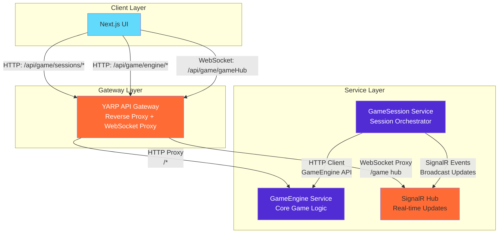
```mermaid
graph TB
    subgraph "Client Layer"
        UI["Next.js UI"]
    end
    
    subgraph "Gateway Layer"
        YARP["YARP API Gateway\nReverse Proxy + WebSocket Proxy"]
    end
    
    subgraph "Service Layer"
        GS["GameSession Service\nSession Orchestrator"]
        GE["GameEngine Service\nCore Game Logic"]
        SR["SignalR Hub\nReal-time Updates"]
    end
    
    %% Client connections through gateway
    UI -->|HTTP: /api/game/sessions/*| YARP
    UI -->|HTTP: /api/game/engine/*| YARP
    UI -->|WebSocket: /api/game/gameHub| YARP
    
    %% Gateway proxy connections
    YARP -->|HTTP Proxy\n/*| GE
    YARP -->|WebSocket Proxy\n/game hub| SR
    
    %% Service-to-Service communication
    GS -->|HTTP Client\nGameEngine API| GE
    GS -->|SignalR Events\nBroadcast Updates| SR

    style UI fill:#61DAFB
    style YARP fill:#FF6B35,color:#fff
    style GS fill:#512BD4,color:#fff
    style GE fill:#512BD4,color:#fff
    style SR fill:#FF6B35
```

## Current Data Flow

### Game Session Flow (with YARP Proxy)
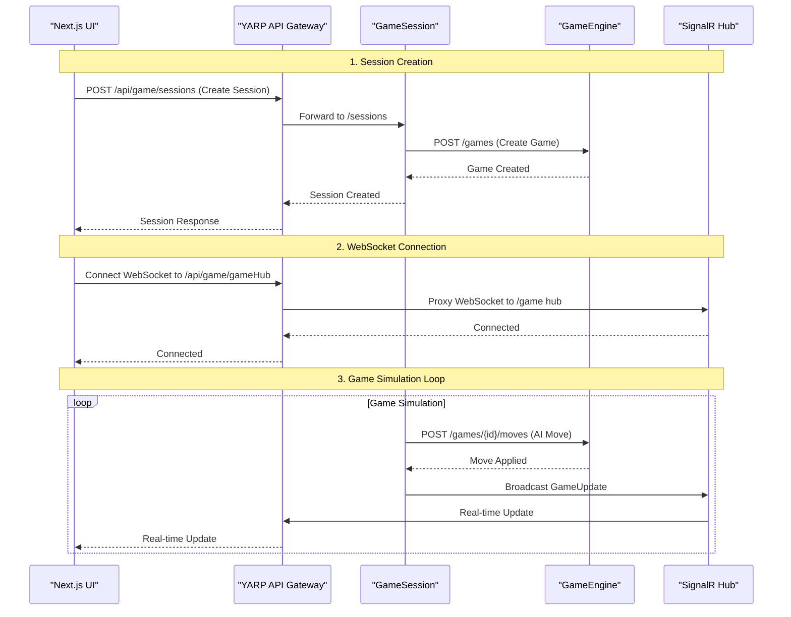
```mermaid
sequenceDiagram
    participant UI as "Next.js UI"
    participant YARP as "YARP API Gateway"
    participant GS as "GameSession"
    participant GE as "GameEngine"
    participant SR as "SignalR Hub"

    Note over UI,SR: 1. Session Creation
    UI->>YARP: POST /api/game/sessions (Create Session)
    YARP->>GS: Forward to /sessions
    GS->>GE: POST /games (Create Game)
    GE-->>GS: Game Created
    GS-->>YARP: Session Created
    YARP-->>UI: Session Response

    Note over UI,SR: 2. WebSocket Connection
    UI->>YARP: Connect WebSocket to /api/game/gameHub
    YARP->>SR: Proxy WebSocket to /game hub
    SR-->>YARP: Connected
    YARP-->>UI: Connected

    Note over UI,SR: 3. Game Simulation Loop
    loop Game Simulation
        GS->>GE: POST /games/{id}/moves (AI Move)
        GE-->>GS: Move Applied
        GS->>SR: Broadcast GameUpdate
        SR->>YARP: Real-time Update
        YARP-->>UI: Real-time Update
    end
```

### Real-time Communication Flow
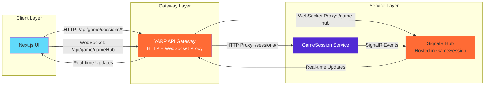
```mermaid
graph LR
    subgraph "Client Layer"
        UI["Next.js UI"]
    end
    
    subgraph "Gateway Layer"
        YARP["YARP API Gateway\nHTTP + WebSocket Proxy"]
    end
    
    subgraph "Service Layer"
        GS["GameSession Service"]
        SR["SignalR Hub\nHosted in GameSession"]
    end
    
    %% Client connections through gateway
    UI -->|HTTP: /api/game/sessions/*| YARP
    UI -->|WebSocket: /api/game/gameHub| YARP
    
    %% Gateway proxy connections
    YARP -->|HTTP Proxy: /sessions/*| GS
    YARP -->|WebSocket Proxy: /game hub| SR
    
    %% Internal service communication
    GS -->|SignalR Events| SR
    
    %% Real-time updates flow
    SR -->|Real-time Updates| YARP
    YARP -->|Real-time Updates| UI
    
    style UI fill:#61DAFB
    style YARP fill:#FF6B35,color:#fff
    style GS fill:#512BD4,color:#fff
    style SR fill:#FF6B35
```

### API Gateway Routing
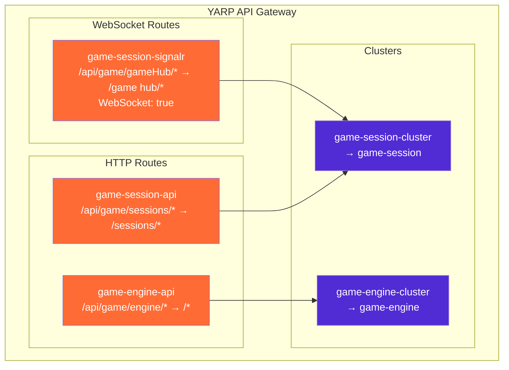
```mermaid
graph TB
    subgraph "YARP API Gateway"
        subgraph "HTTP Routes"
            R1["game-session-api\n/api/game/sessions/* → /sessions/*"]
            R2["game-engine-api\n/api/game/engine/* → /*"]
        end
        
        subgraph "WebSocket Routes"
            R3["game-session-signalr\n/api/game/gameHub/* → /game hub/*\nWebSocket: true"]
        end
        
        subgraph "Clusters"
            C1["game-session-cluster\n→ game-session"]
            C2["game-engine-cluster\n→ game-engine"]
        end
    end
    
    R1 --> C1
    R2 --> C2
    R3 --> C1
    
    style R1 fill:#FF6B35,color:#fff
    style R2 fill:#FF6B35,color:#fff
    style R3 fill:#FF6B35,color:#fff
    style C1 fill:#512BD4,color:#fff
    style C2 fill:#512BD4,color:#fff
``` 

---

## 1. Persistence & State Management

### Reasoning
Explain why persistent storage is needed (durability, scaling, etc.).

### Implementation Details
- Replace in-memory repositories in GameEngine and GameSession with a real database (e.g., Supabase/PostgreSQL).
- Add Entity Framework Core or Dapper for DB access.
- Update repository interfaces and implementations.
- Add migration scripts.
- Update configuration files for DB connection strings.
- Test CRUD operations.

#### Code Hints
- Show how to register DbContext in Program.cs
- Example of a repository method using EF Core

### Tools/Libraries
- Supabase/PostgreSQL
- Entity Framework Core (or Dapper)

### Resulting Architecture
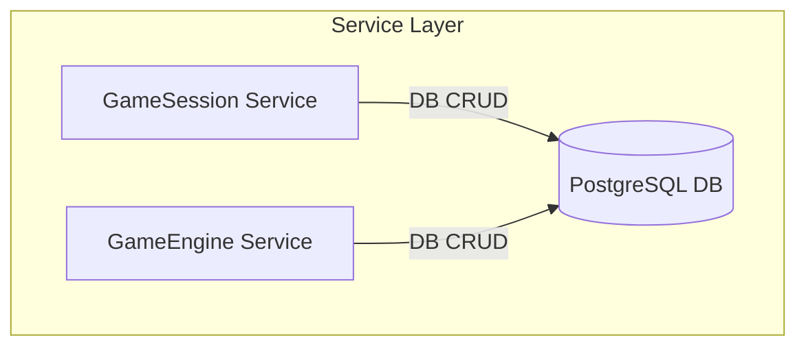
```mermaid
graph TB
    subgraph "Service Layer"
        GS[GameSession Service]
        GE[GameEngine Service]
        DB[(PostgreSQL DB)]
    end
    GS -- DB CRUD --> DB
    GE -- DB CRUD --> DB
```

---

## 2. Concurrency & Thread Safety [Feature, Scalability]

_No change to system architecture diagram for this step._

> **Note:**
> This step involves internal code changes (e.g., using locks, thread-safe collections, or database transactions) to ensure that multiple users can safely interact with the system at the same time. No new components or protocols are introduced.

---

## 3. Security

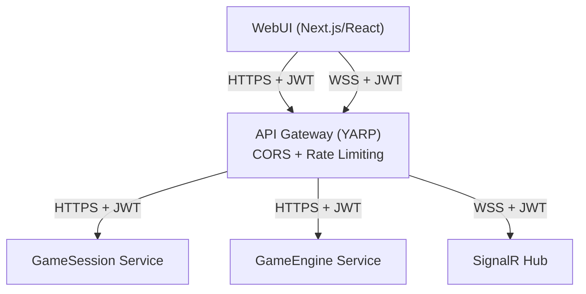
```mermaid
flowchart TD
  A["WebUI (Next.js/React)"] -- "HTTPS + JWT" --> B["API Gateway (YARP)\nCORS + Rate Limiting"]
  B -- "HTTPS + JWT" --> C[GameSession Service]
  B -- "HTTPS + JWT" --> D[GameEngine Service]
  A -- "WSS + JWT" --> B
  B -- "WSS + JWT" --> E[SignalR Hub]
```
> **Explanation:**
> - All HTTP traffic is now secured with HTTPS and JWT authentication.
> - The API Gateway enforces CORS and rate limiting.
> - SignalR/WebSocket connections are authenticated with JWT.

---

## 4. API Maturity & Documentation

_No change to system architecture diagram for this step._

> **Note:**
> This step adds API versioning, error contracts, and OpenAPI/Swagger documentation. The system structure remains the same, but APIs are easier to use and evolve.

---

## 5. Observability & Monitoring

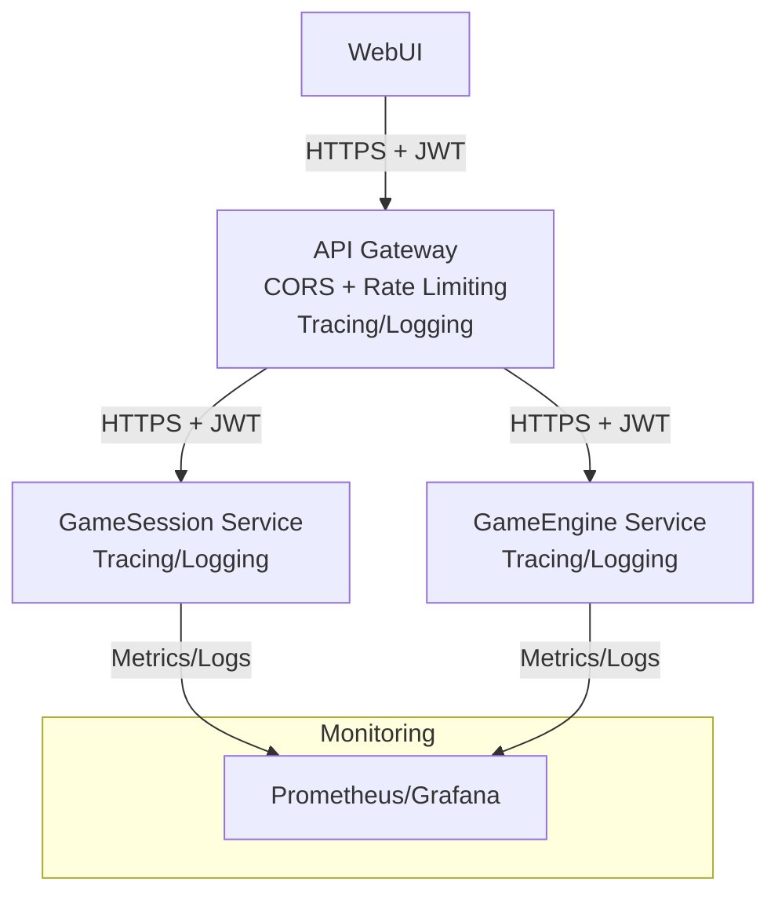
```mermaid
flowchart TD
  subgraph Monitoring
    F[Prometheus/Grafana]
  end
  A[WebUI] -- "HTTPS + JWT" --> B[API Gateway\nCORS + Rate Limiting\nTracing/Logging]
  B -- "HTTPS + JWT" --> C[GameSession Service\nTracing/Logging]
  B -- "HTTPS + JWT" --> D[GameEngine Service\nTracing/Logging]
  C -- "Metrics/Logs" --> F
  D -- "Metrics/Logs" --> F
```
> **Explanation:**
> - Prometheus and Grafana are added for metrics and dashboards.
> - All services and the gateway now emit logs and traces.

---

## 6. API Gateway Enhancements

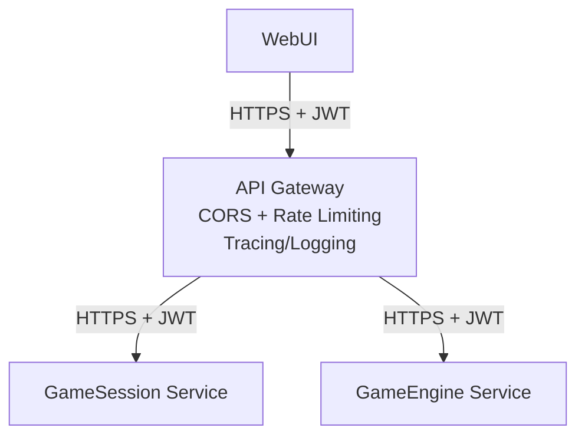
```mermaid
flowchart TD
  A[WebUI] -- "HTTPS + JWT" --> B[API Gateway\nCORS + Rate Limiting\nTracing/Logging]
  B -- "HTTPS + JWT" --> C[GameSession Service]
  B -- "HTTPS + JWT" --> D[GameEngine Service]
```
> **Explanation:**
> - The API Gateway now includes enhanced rate limiting, request/response logging, and distributed tracing.

---

## 7. Frontend Enhancements

_No change to system architecture diagram for this step._

> **Note:**
> Frontend improvements (accessibility, state management, optimistic UI) do not affect backend architecture.

---

## 8. Advanced Game Features (User-Selectable Strategies, History, Redis Leaderboard)

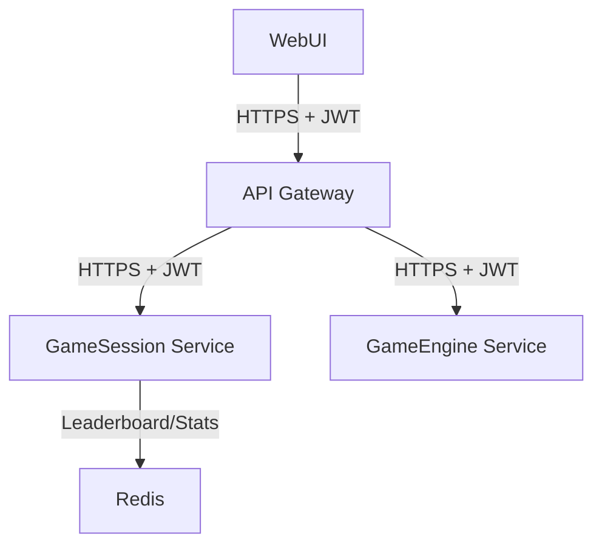
```mermaid
flowchart TD
  A[WebUI] -- "HTTPS + JWT" --> B[API Gateway]
  B -- "HTTPS + JWT" --> C[GameSession Service]
  B -- "HTTPS + JWT" --> D[GameEngine Service]
  C -- "Leaderboard/Stats" --> E[Redis]
```
> **Explanation:**
> - Redis is added for leaderboard and strategy analytics.
> - GameSession Service interacts with Redis to store and retrieve stats.

---

## 9. Business Intelligence & Analytics

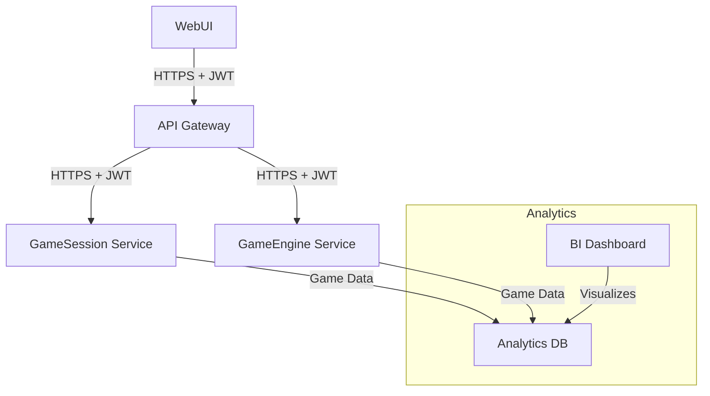
```mermaid
flowchart TD
  subgraph Analytics
    F[BI Dashboard]
    G[Analytics DB]
  end
  A[WebUI] -- "HTTPS + JWT" --> B[API Gateway]
  B -- "HTTPS + JWT" --> C[GameSession Service]
  B -- "HTTPS + JWT" --> D[GameEngine Service]
  C -- "Game Data" --> G
  D -- "Game Data" --> G
  F -- "Visualizes" --> G
```
> **Explanation:**
> - Game data is sent to an analytics database.
> - A BI dashboard visualizes win ratios, strategy performance, etc.

---

## 10. gRPC Integration

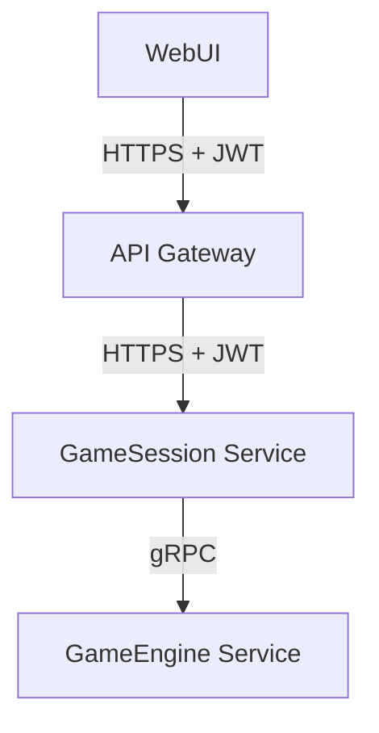
```mermaid
flowchart TD
  C[GameSession Service] -- "gRPC" --> D[GameEngine Service]
  A[WebUI] -- "HTTPS + JWT" --> B[API Gateway]
  B -- "HTTPS + JWT" --> C
```
> **Explanation:**
> - GameSession and GameEngine now communicate via gRPC for faster, strongly-typed internal calls.

---

## 11. GraphQL API Layer

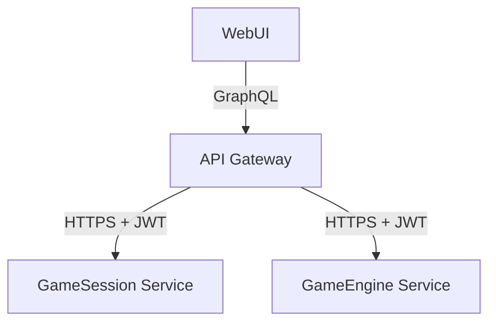
```mermaid
flowchart TD
  A[WebUI] -- "GraphQL" --> B[API Gateway]
  B -- "HTTPS + JWT" --> C[GameSession Service]
  B -- "HTTPS + JWT" --> D[GameEngine Service]
```
> **Explanation:**
> - The API Gateway exposes a GraphQL endpoint for flexible, client-driven queries.

---

## 12. Event-Driven Architecture (EDA) with Kafka

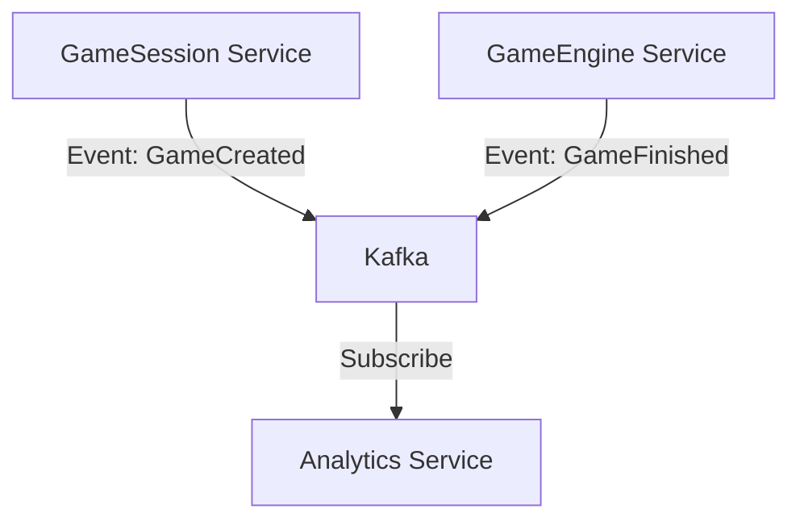
```mermaid
flowchart TD
  C[GameSession Service] -- "Event: GameCreated" --> F[Kafka]
  D[GameEngine Service] -- "Event: GameFinished" --> F
  F -- "Subscribe" --> G[Analytics Service]
```
> **Explanation:**
> - Kafka is added for event-driven communication.
> - Services publish and subscribe to events for decoupled workflows.

---

## 13. Service Discovery with Consul

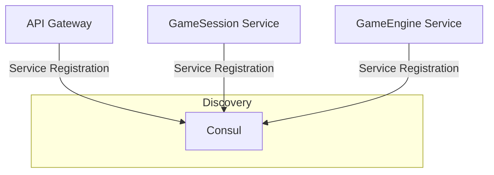
```mermaid
flowchart TD
  subgraph Discovery
    F[Consul]
  end
  B[API Gateway] -- "Service Registration" --> F
  C[GameSession Service] -- "Service Registration" --> F
  D[GameEngine Service] -- "Service Registration" --> F
```
> **Explanation:**
> - All services register with Consul for dynamic service discovery.

---

## 14. Service Mesh with Istio & Envoy

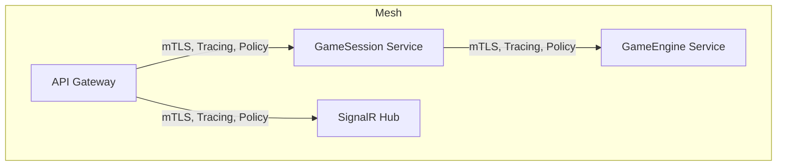
```mermaid
flowchart TD
  subgraph Mesh
    B[API Gateway]
    C[GameSession Service]
    D[GameEngine Service]
    E[SignalR Hub]
  end
  B -- "mTLS, Tracing, Policy" --> C
  C -- "mTLS, Tracing, Policy" --> D
  B -- "mTLS, Tracing, Policy" --> E
```
> **Explanation:**
> - All service-to-service traffic is managed by Istio/Envoy, providing mTLS, tracing, and policy enforcement.

---

## 15. Dapr for Sidecar Pattern

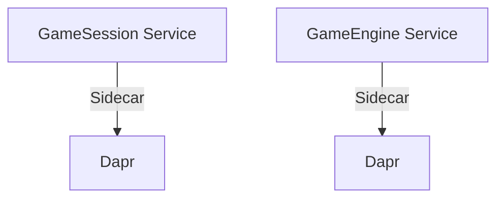
```mermaid
flowchart TD
  C[GameSession Service] -- "Sidecar" --> F[Dapr]
  D[GameEngine Service] -- "Sidecar" --> G[Dapr]
```
> **Explanation:**
> - Each service has a Dapr sidecar for cross-cutting concerns (pub/sub, state, secrets).

---

## 16. Kubernetes for Container Orchestration

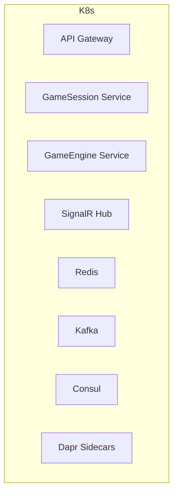
```mermaid
flowchart TD
  subgraph K8s
    B[API Gateway]
    C[GameSession Service]
    D[GameEngine Service]
    E[SignalR Hub]
    F[Redis]
    G[Kafka]
    H[Consul]
    I[Dapr Sidecars]
  end
```
> **Explanation:**
> - All components are deployed as containers in Kubernetes, managed and scaled automatically.

---

## 17. Documentation & Developer Experience

_No change to system architecture diagram for this step._

> **Note:**
> This step improves documentation, onboarding, and developer tooling, but does not change the system structure.

---

## 18. Development & Testing Best Practices [Development, Testing, Quality]

### Reasoning
Ensures code quality, maintainability, and confidence in changes.

### Implementation Details
- Use FluentValidation for API and DTO validation.
- Enforce code style and static analysis (.editorconfig, Prettier, dotnet-format).
- Automate dependency updates and vulnerability checks (Dependabot, NuGet Audit).
- Keep OpenAPI docs and TypeScript types in sync (codegen).
- Use xUnit/Jest for unit tests, Testcontainers for integration, Playwright for E2E.
- Run all tests in CI with coverage reporting (Coverlet, Codecov).
- Use Moq/NSubstitute for mocking in .NET, MSW for frontend API mocking.

### Tools/Libraries
- FluentValidation, DataAnnotations
- .editorconfig, Prettier, dotnet-format
- Dependabot, NuGet Audit
- xUnit, Jest, Testcontainers, Playwright, Coverlet, Codecov
- Moq, NSubstitute, MSW
- OpenAPI/Swagger codegen

_No change to system architecture diagram for this step._

> **Note:**
> This step is about development workflow and testing quality, not system architecture.

---

## 19. Player vs Player (P2P) & Spectator Modes

### Reasoning
Allowing two human players to compete in real-time and spectators to watch increases engagement and demonstrates real-time, multi-user system design.

### Implementation Details
- Enhance SignalR hub to manage multiple clients per session.
- Implement turn-based logic and session membership.
- Add a "spectator" role that receives updates but cannot make moves.
- Update frontend to support joining as player or spectator.

#### Code Hints
- Example of SignalR group management.
- Example of role-based access in SignalR.

### Tools/Libraries
- SignalR
- Role-based access logic

### Resulting Architecture
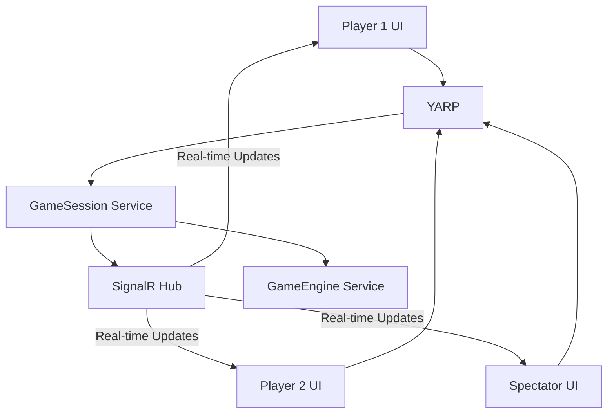
```mermaid
graph TD
    UI1[Player 1 UI] --> YARP
    UI2[Player 2 UI] --> YARP
    SPEC[Spectator UI] --> YARP
    YARP --> GS[GameSession Service]
    GS --> SR[SignalR Hub]
    SR -->|Real-time Updates| UI1
    SR -->|Real-time Updates| UI2
    SR -->|Real-time Updates| SPEC
    GS --> GE[GameEngine Service]
```
> **Explanation:**
> - Multiple players and spectators connect to the same session.
> - SignalR manages real-time updates for all participants.

---

## 20. Resilience & Fault Tolerance Patterns

### Reasoning
Ensures the system can handle transient errors and outages gracefully, improving reliability.

### Implementation Details
- Use Polly for circuit breaker, retry, and timeout policies on all inter-service calls.
- Enhance health checks to include dependencies (DB, message broker, etc.).

#### Code Hints
- Example of Polly policy registration.
- Example of deep health check implementation.

### Tools/Libraries
- Polly
- HealthChecks

_No change to system architecture diagram for this step._

> **Note:**
> This step is about internal resilience and reliability; no new components are added.

---

## 21. Robust Configuration & Secrets Management

### Reasoning
Protects sensitive information and supports secure, flexible configuration for all environments.

### Implementation Details
- Use .NET User Secrets for local development.
- Use cloud secret stores (Azure Key Vault, AWS Secrets Manager, etc.) for production.
- Integrate secrets into CI/CD pipelines.

#### Code Hints
- Example of loading secrets from configuration providers.
- Example of using secrets in CI/CD.

### Tools/Libraries
- .NET User Secrets
- Azure Key Vault / AWS Secrets Manager
- GitHub Actions Secrets

_No change to system architecture diagram for this step._

> **Note:**
> This step is about configuration and security best practices; no new components are added.

---

## 22. Free-Tier Cloud Deployment

### Reasoning
Make the project accessible to anyone, anywhere, at no cost.

### Implementation Details
- Use GitHub Actions to build and deploy containers.
- Deploy backend to Azure Container Apps (free), Render.com (free), or similar.
- Deploy frontend to Vercel (free).
- Use GitHub Container Registry or Docker Hub for images.

### Tools/Libraries
- GitHub Actions
- Azure Container Apps (free tier)
- Render.com (free tier)
- Vercel (free tier)
- Docker Hub or GitHub Container Registry

#### Deployment Flow Diagram
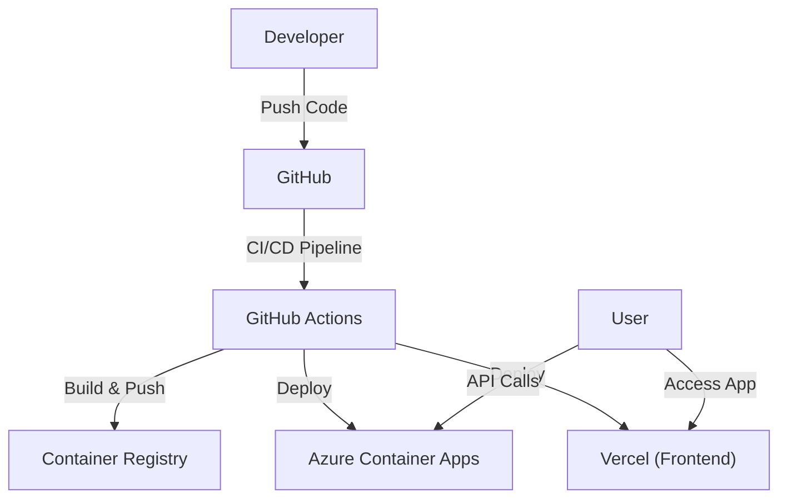
```mermaid
flowchart TD
  Dev["Developer"] -- "Push Code" --> GH["GitHub"]
  GH -- "CI/CD Pipeline" --> CI["GitHub Actions"]
  CI -- "Build & Push" --> CR["Container Registry"]
  CI -- "Deploy" --> ACA["Azure Container Apps"]
  CI -- "Deploy" --> Vercel["Vercel (Frontend)"]
  User["User"] -- "Access App" --> Vercel
  User -- "API Calls" --> ACA
```
> **Explanation:**
> - Code is pushed to GitHub, triggering CI/CD.
> - Containers are built and pushed to a registry.
> - Backend is deployed to Azure Container Apps (or similar), frontend to Vercel.
> - Users access the frontend and backend via the cloud.

_No change to system architecture diagram for this step._

> **Note:**
> This step is about operational deployment and does not change the system architecture.

---

## 23. Free DNS & Domain Configuration

### Reasoning
Make the app accessible via a memorable URL, using only free services.

### Implementation Details
- Register a free subdomain (DuckDNS, or use Vercel’s default).
- Configure DNS A/CNAME records to point to your cloud service.
- Document the process for contributors.

### Tools/Libraries
- DuckDNS
- Vercel (default subdomain)
- DNS provider

#### DNS Resolution Diagram
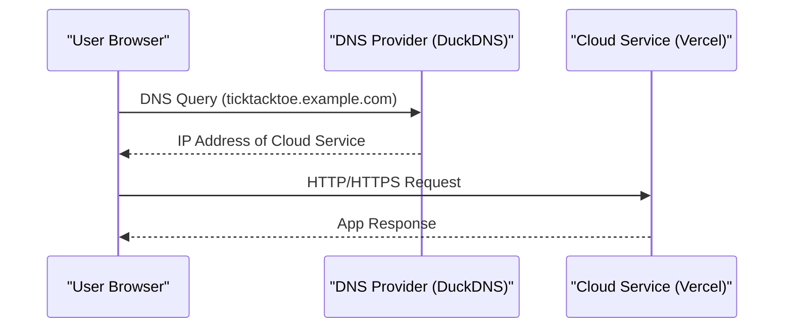
```mermaid
sequenceDiagram
  participant User as "User Browser"
  participant DNS as "DNS Provider (DuckDNS)"
  participant Cloud as "Cloud Service (Vercel)"

  User->>DNS: DNS Query (ticktacktoe.example.com)
  DNS-->>User: IP Address of Cloud Service
  User->>Cloud: HTTP/HTTPS Request
  Cloud-->>User: App Response
```
> **Explanation:**
> - User’s browser queries DNS for your domain.
> - DNS provider returns the IP address of your cloud service.
> - User connects to your app via the resolved address.

_No change to system architecture diagram for this step._

> **Note:**
> This step is about DNS and domain configuration and does not change the system architecture.

---

## Final Architecture Overview

### Final System Architecture
```mermaid
graph TB
    %% Client Layer
    subgraph "Client Layer"
        UI["Next.js UI"]
    end

    %% Gateway Layer
    subgraph "Gateway Layer"
        YARP["YARP API Gateway\nReverse Proxy + WebSocket Proxy"]
    end

    %% Service Layer
    subgraph "Service Layer"
        GS["GameSession Service\nSession Orchestrator"]
        GE["GameEngine Service\nCore Game Logic"]
        SR["SignalR Hub\nReal-time Updates"]
    end

    %% Infrastructure Layer
    subgraph "Infrastructure Layer"
        REDIS["Redis\nLeaderboard/Stats"]
        KAFKA["Kafka\nEvent Bus"]
        CONSUL["Consul\nService Discovery"]
        ISTIO["Istio/Envoy\nService Mesh"]
        DAPR["Dapr Sidecars"]
        K8S["Kubernetes\nContainer Orchestration"]
    end

    %% Client connections through gateway
    UI -- "HTTP: /api/game/sessions/*" --> YARP
    UI -- "HTTP: /api/game/engine/*" --> YARP
    UI -- "WebSocket: /api/game/gameHub" --> YARP
    UI -- "GraphQL" --> YARP

    %% Gateway proxy connections
    YARP -- "HTTP Proxy\n/sessions/*" --> GS
    YARP -- "HTTP Proxy\n/engine/*" --> GE
    YARP -- "WebSocket Proxy\n/game hub" --> SR
    YARP -- "gRPC" --> GE
    YARP -- "GraphQL" --> GS

    %% Service-to-Service communication
    GS -- "HTTP/gRPC" --> GE
    GS -- "SignalR Events\nBroadcast Updates" --> SR
    GS -- "Kafka Events" --> KAFKA
    GE -- "Kafka Events" --> KAFKA
    GS -- "Redis\nLeaderboard/Stats" --> REDIS

    %% Service Discovery, Mesh, Dapr
    GS -- "Service Discovery" --> CONSUL
    GE -- "Service Discovery" --> CONSUL
    YARP -- "Service Discovery" --> CONSUL
    GS -- "Service Mesh" --> ISTIO
    GE -- "Service Mesh" --> ISTIO
    YARP -- "Service Mesh" --> ISTIO
    GS -- "Dapr Sidecar" --> DAPR
    GE -- "Dapr Sidecar" --> DAPR

    %% Orchestration
    GS -- "K8s Pod" --> K8S
    GE -- "K8s Pod" --> K8S
    YARP -- "K8s Pod" --> K8S
    SR -- "K8s Pod" --> K8S
    REDIS -- "K8s Pod" --> K8S
    KAFKA -- "K8s Pod" --> K8S
    CONSUL -- "K8s Pod" --> K8S
    ISTIO -- "K8s Pod" --> K8S
    DAPR -- "K8s Pod" --> K8S

    %% Real-time updates
    SR -- "Real-time Updates" --> YARP
    YARP -- "Real-time Updates" --> UI

    %% Styling
    style UI fill:#61DAFB
    style YARP fill:#FF6B35,color:#fff
    style GS fill:#512BD4,color:#fff
    style GE fill:#512BD4,color:#fff
    style SR fill:#FF6B35
    style REDIS fill:#DC143C,color:#fff
    style KAFKA fill:#000000,color:#fff
    style CONSUL fill:#8D3EFF,color:#fff
    style ISTIO fill:#0080FF,color:#fff
    style DAPR fill:#6A1B9A,color:#fff
    style K8S fill:#326CE5,color:#fff
```

### Final Data Flow
```mermaid
sequenceDiagram
    participant UI as "Next.js UI"
    participant YARP as "YARP API Gateway"
    participant GS as "GameSession"
    participant GE as "GameEngine"
    participant SR as "SignalR Hub"

    Note over UI,SR: 1. Session Creation
    UI->>YARP: POST /api/game/sessions (Create Session)
    YARP->>GS: Forward to /sessions
    GS->>GE: POST /games (Create Game)
    GE-->>GS: Game Created
    GS-->>YARP: Session Created
    YARP-->>UI: Session Response

    Note over UI,SR: 2. WebSocket Connection
    UI->>YARP: Connect WebSocket to /api/game/gameHub
    YARP->>SR: Proxy WebSocket to /game hub
    SR-->>YARP: Connected
    YARP-->>UI: Connected

    Note over UI,SR: 3. Game Simulation Loop
    loop Game Simulation
        GS->>GE: POST /games/{id}/moves (AI Move)
        GE-->>GS: Move Applied
        GS->>SR: Broadcast GameUpdate
        SR->>YARP: Real-time Update
        YARP-->>UI: Real-time Update
    end
```

### Real-Time Communication Flow
```mermaid
graph LR
    subgraph "Client Layer"
        UI["Next.js UI"]
    end
    
    subgraph "Gateway Layer"
        YARP["YARP API Gateway\nHTTP + WebSocket Proxy"]
    end
    
    subgraph "Service Layer"
        GS["GameSession Service"]
        SR["SignalR Hub\nHosted in GameSession"]
    end
    
    %% Client connections through gateway
    UI -->|HTTP: /api/game/sessions/*| YARP
    UI -->|WebSocket: /api/game/gameHub| YARP
    
    %% Gateway proxy connections
    YARP -->|HTTP Proxy: /sessions/*| GS
    YARP -->|WebSocket Proxy: /game hub| SR
    
    %% Internal service communication
    GS -->|SignalR Events| SR
    
    %% Real-time updates flow
    SR -->|Real-time Updates| YARP
    YARP -->|Real-time Updates| UI
    
    style UI fill:#61DAFB
    style YARP fill:#FF6B35,color:#fff
    style GS fill:#512BD4,color:#fff
    style SR fill:#FF6B35
```

### API Gateway Routing
```mermaid
graph TB
    subgraph "YARP API Gateway"
        subgraph "HTTP Routes"
            R1["game-session-api\n/api/game/sessions/* → /sessions/*"]
            R2["game-engine-api\n/api/game/engine/* → /*"]
        end
        
        subgraph "WebSocket Routes"
            R3["game-session-signalr\n/api/game/gameHub/* → /game hub/*\nWebSocket: true"]
        end
        
        subgraph "Clusters"
            C1["game-session-cluster\n→ game-session"]
            C2["game-engine-cluster\n→ game-engine"]
        end
    end
    
    R1 --> C1
    R2 --> C2
    R3 --> C1
    
    style R1 fill:#FF6B35,color:#fff
    style R2 fill:#FF6B35,color:#fff
    style R3 fill:#FF6B35,color:#fff
    style C1 fill:#512BD4,color:#fff
    style C2 fill:#512BD4,color:#fff
```